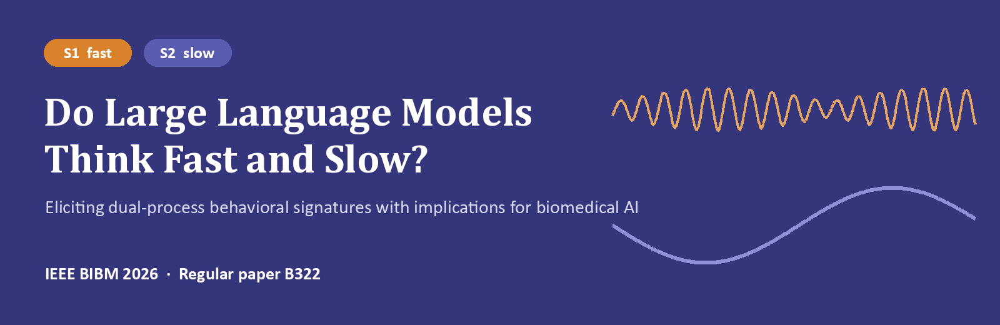
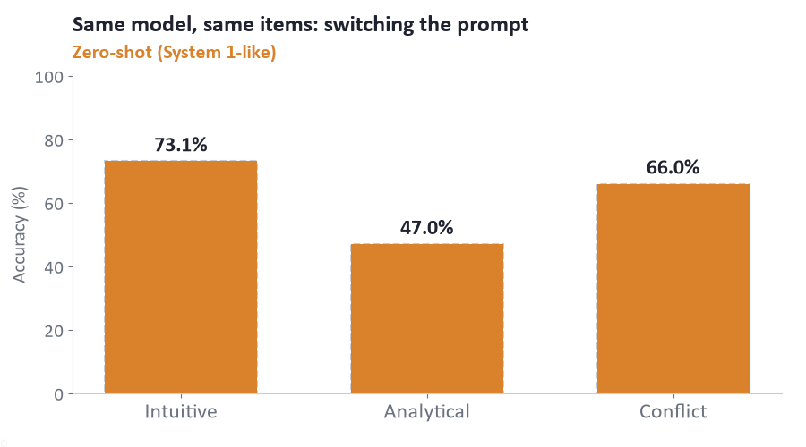
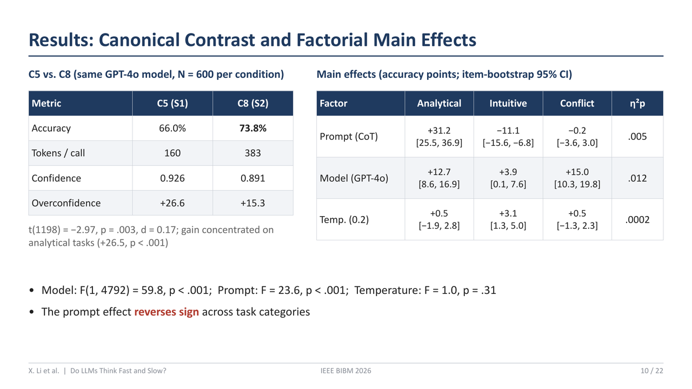
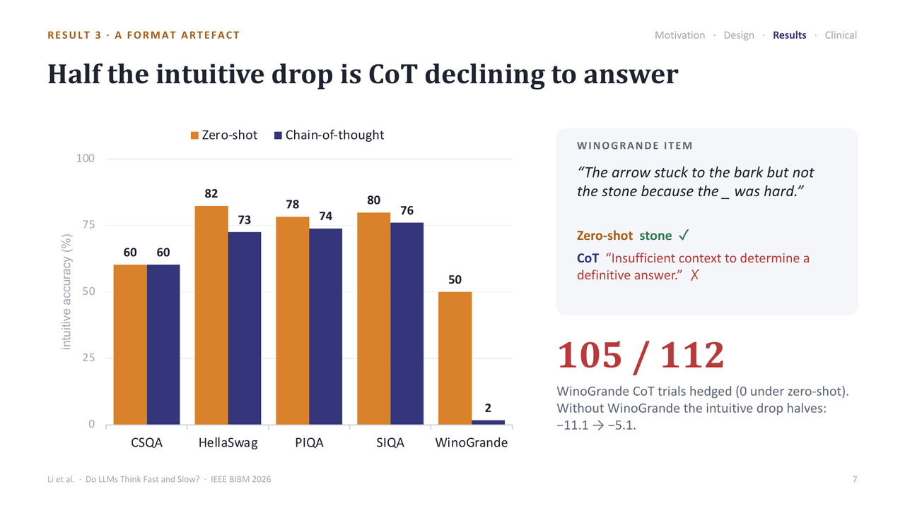
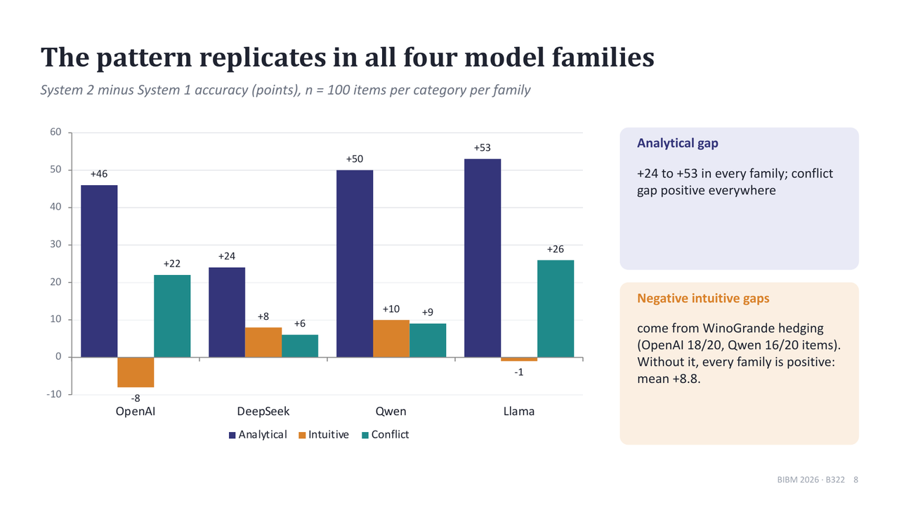
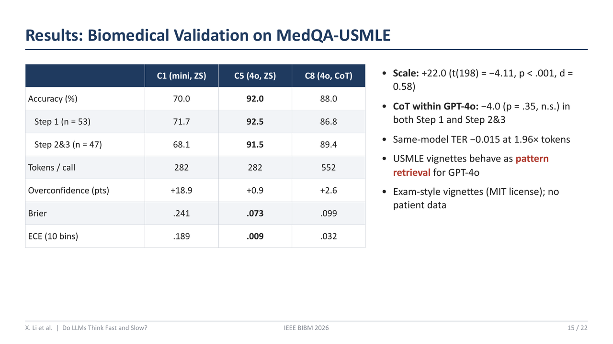
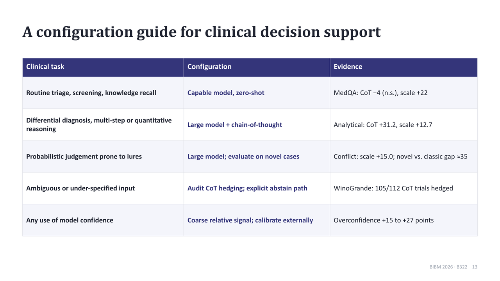
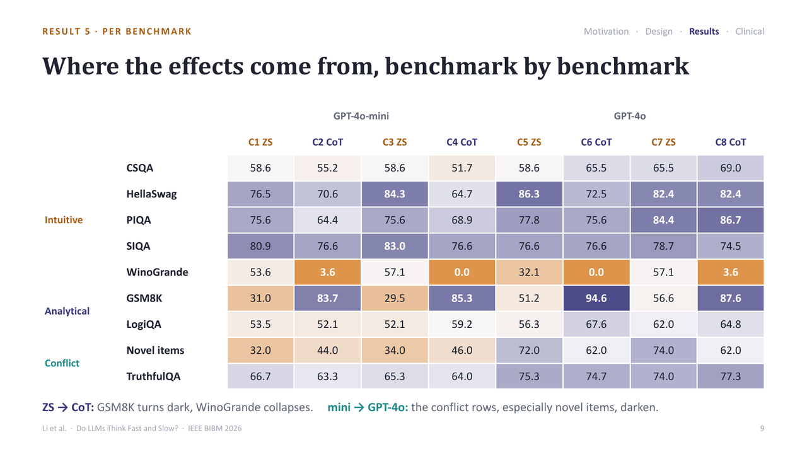
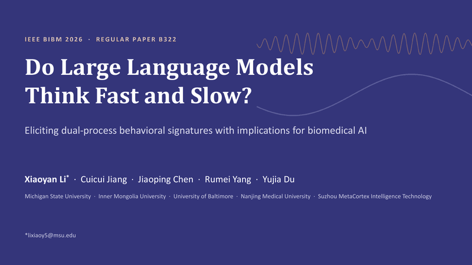

<p align="center">
  
</p>

<p align="center">
  <a href="#citation"></a>
  
  
  
  <a href="LICENSE"></a>
</p>

<p align="center">
  Xiaoyan Li · <b>Cuicui Jiang</b><sup>*</sup> · Jiaoping Chen · Rumei Yang · Yujia Du<br>
  <sub>Michigan State University · Inner Mongolia University · University of Baltimore · Nanjing Medical University · Suzhou MetaCortex Intelligence Technology</sub><br>
  <sub><sup>*</sup>Corresponding author: jiangcuicui@mail.imu.edu.cn</sub>
</p>

---

Dual-process theory separates fast, intuitive **System 1** thinking from slow, analytical **System 2** thinking, and clinicians switch between the two all the time. This repository contains the code, prompts, novel test items and trial-level outputs behind our IEEE BIBM 2026 paper, which asks whether large language models can be *configured* to show System 1- or System 2-like behavior, and what that means for clinical decision support.

Earlier comparisons changed model size, temperature and prompt all at once. We isolate each factor with a **2 × 2 × 2 factorial ablation** (4,800 trials), replicate across **four model families**, and validate on **MedQA-USMLE**.

<p align="center">
  
</p>

## Key findings

**1. Chain-of-thought helps analytical tasks and hurts intuitive ones.** Averaged over model and temperature, CoT adds **+31.2** points on analytical tasks, costs **−11.1** on intuitive tasks, and leaves conflict tasks unchanged (−0.2). The Prompt × Task Category interaction is strong, *F*(2, 4794) = 89.2, *p* < .001, η²ₚ = .036, and survives blocking on benchmark (*F* = 94.7) or item (*F* = 188.1). Model capacity helps everywhere; temperature is negligible.

<p align="center"></p>

**2. Half of the intuitive drop is CoT refusing to commit.** On WinoGrande, CoT answers "insufficient context" in 105 of 112 trials instead of picking an option. Without WinoGrande the intuitive decrement halves to −5.1, and the interaction still holds (*F*(2, 4570) = 71.7). Deliberation can produce non-answers on ambiguous input, which matters for clinical tools.

<p align="center"></p>

**3. The pattern replicates in OpenAI, DeepSeek, Qwen and Llama.** The System 2 advantage is largest on analytical tasks in every family (+24 to +53 points) and positive on conflict tasks. Negative intuitive gaps come from the same WinoGrande hedging; without it every family is positive.

<p align="center"></p>

**4. Novel items expose memorization.** With answer options randomized, GPT-4o-mini scores 66.7% on classic TruthfulQA items but only 32.0% on our 50 structurally matched novel items. Benchmarks built from classic problems overestimate robustness to intuitive lures.

**5. On MedQA-USMLE, scale helps and deliberation does not.** Moving from GPT-4o-mini to GPT-4o adds +22 points; adding CoT to GPT-4o changes nothing significant (88% vs. 92%), in both Step 1 and Step 2&3 questions. Zero-shot GPT-4o is also the best calibrated (ECE = .009).

<p align="center"></p>

**6. What this means for clinical decision support.**

<p align="center"></p>

<details>
<summary><b>Per-benchmark heatmap (all 4,800 factorial trials and the four families)</b></summary>
<p align="center"></p>
</details>

## Study design

| Condition | Model | Temperature | Prompt | Role |
|:--|:--|:--:|:--|:--|
| C1 | GPT-4o-mini | 0.9 | zero-shot | canonical System 1 |
| C2 | GPT-4o-mini | 0.9 | chain-of-thought | |
| C3 | GPT-4o-mini | 0.2 | zero-shot | |
| C4 | GPT-4o-mini | 0.2 | chain-of-thought | |
| C5 | GPT-4o | 0.9 | zero-shot | primary contrast vs. C8 |
| C6 | GPT-4o | 0.9 | chain-of-thought | |
| C7 | GPT-4o | 0.2 | zero-shot | |
| C8 | GPT-4o | 0.2 | chain-of-thought | canonical System 2 |

Every condition answers the **same 600 items**: 200 intuitive (HellaSwag, PIQA, SIQA, CommonsenseQA, WinoGrande), 200 analytical (GSM8K, LogiQA) and 200 conflict items (150 TruthfulQA + 50 novel items; option positions shuffled by a deterministic per-item hash). The cross-family replication pairs GPT-4o-mini / GPT-4o, DeepSeek-Chat / DeepSeek-R1, Qwen2.5-7B / 72B-Instruct and Llama 3.1 8B / Llama 3.3 70B on 100 items per category.

<details>
<summary><b>Example novel conflict items</b> (all 50 are in <code>data/novel_conflict_tasks.json</code>)</summary>

| Type | Item | Intuitive lure → correct |
|:--|:--|:--|
| CRT variant | A laptop and a mouse cost $310 in total. The laptop costs $300 more than the mouse. How much does the mouse cost? | $10 → **$5** |
| Base-rate neglect | In a company of 1000 employees, 5 are engineers and 995 are salespeople. Tom is quiet, enjoys puzzles, and prefers working alone. Engineer or salesperson? | engineer → **salesperson** |
| Biomedical Bayesian | A screening test for a rare disease (prevalence 1 in 10,000) has 99% sensitivity and 99% specificity. A random patient tests positive. How likely is disease? | 99% → **≈1%** |

</details>

## Getting started

```bash
git clone https://github.com/xiaoyanLi629/dual-process-llm.git
cd dual-process-llm
python -m venv venv && source venv/bin/activate
pip install -r requirements.txt
```

**Reproduce the paper's statistics without any model API calls.** All trial-level outputs are in `results/bibm_2026/`, so the ANOVAs, bootstrap confidence intervals, blocking checks, hedging counts, token accounting and MedQA tables can be recomputed locally (the MedQA step downloads the dataset metadata from Hugging Face):

```bash
python src/analysis/camera_ready_stats.py      # writes results/bibm_2026/camera_ready_stats.json
python src/visualization/bibm_figures_v3.py    # regenerates the paper figures in IEEE_manuscript/figures/
```

**Re-run the experiments.** API keys are read from the environment; copy the template and fill it in (`.env` is git-ignored). A single OpenRouter key covers all four model families.

```bash
cp .env.example .env && $EDITOR .env

python -m src.experiments.run_all_bibm --all --dry_run                         # 1 item per condition, checks the pipeline
python -m src.experiments.run_all_bibm --experiment main --n_samples 200        # 2x2x2 factorial (paper setting)
python -m src.experiments.run_all_bibm --experiment multi_model --n_samples 100 # four-family replication
python -m src.experiments.run_all_bibm --analyze_only --input results/bibm_2026 # post-hoc analyses only
```

The benchmark items are not redistributed here; `data/download_data.py` and `data/prepare_bibm_dataset.py` rebuild the task pool from the original public datasets.

## What is in this repository

```
├── assets/                    README figures and animations
├── data/
│   ├── novel_conflict_tasks.json      50 novel conflict items (5 subcategories × 10)
│   ├── human_benchmarks.json          published human effect sizes used in the qualitative comparison
│   ├── download_data.py               fetches the public benchmarks
│   └── prepare_bibm_dataset.py        builds the task pool
├── results/bibm_2026/
│   ├── main_experiment_v2/            factorial ablation, 8 conditions × 600 trials
│   ├── multi_model/                   four-family replication
│   ├── conflict_rerun/                stratified, option-randomized conflict runs
│   ├── medqa/                         MedQA-USMLE outputs (C1, C5, C8; 100 items)
│   ├── human_comparison/              qualitative human comparison tables
│   ├── paper_stats_final.json         numbers reported in the paper
│   └── camera_ready_stats.json        additional camera-ready statistics
├── src/
│   ├── experiments/                   factorial, multi-model, human comparison, statistics
│   ├── analysis/camera_ready_stats.py offline re-analysis of all trial-level data
│   ├── tasks/                         task loading, stratified sampling, option shuffling
│   ├── evaluation/                    answer parsing and scoring
│   └── visualization/                 figure generation
└── IEEE_manuscript/                   LaTeX source of the camera-ready paper
```

Each trial record stores the condition, task id, category, parsed answer, gold answer, correctness, the model's self-reported confidence and the API-reported token count (`usage.total_tokens`, i.e. prompt plus completion).

## Talk

<p align="center">
  
</p>

## Citation

```bibtex
@inproceedings{li2026dualprocess,
  title     = {Do Large Language Models Think Fast and Slow? Eliciting Dual-Process
               Behavioral Signatures with Implications for Biomedical AI},
  author    = {Li, Xiaoyan and Jiang, Cuicui and Chen, Jiaoping and Yang, Rumei and Du, Yujia},
  booktitle = {Proceedings of the IEEE International Conference on Bioinformatics and Biomedicine (BIBM)},
  year      = {2026}
}
```

## License

Code and the novel conflict items are released under the [MIT License](LICENSE). MedQA-USMLE is used under its original MIT license; the other benchmarks remain under their own licenses.
